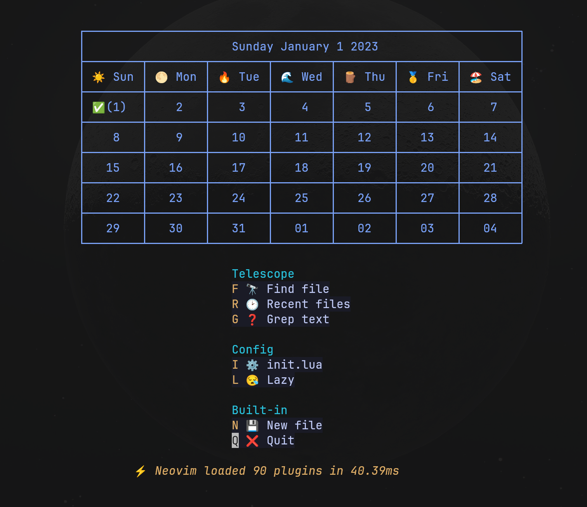

# Calendar Implementation with lua

Create calender string output to you.

You can easily use this as dashboard header
or like those things by

```lua

require("calendar").getCalendar()
-- this will returns you a calender string.
-- no config needed

```

### Showcase

##### string output


##### with dashboard plugins



